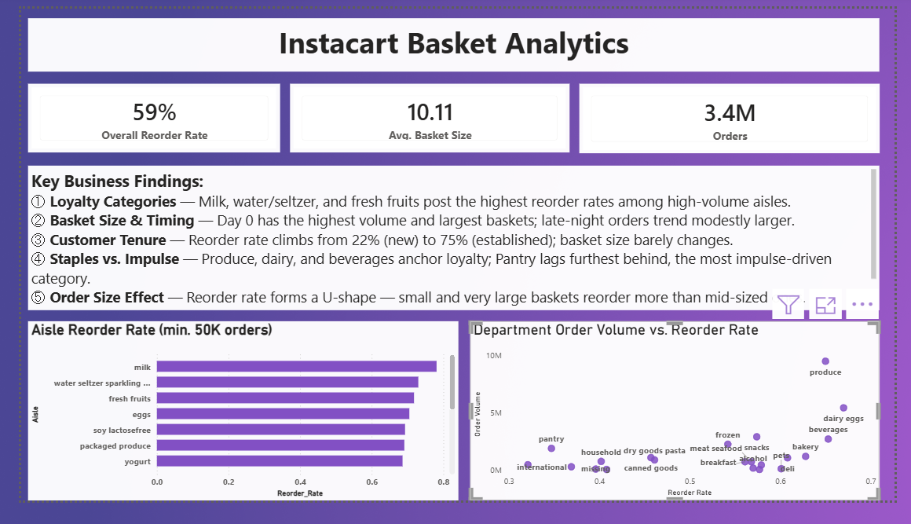
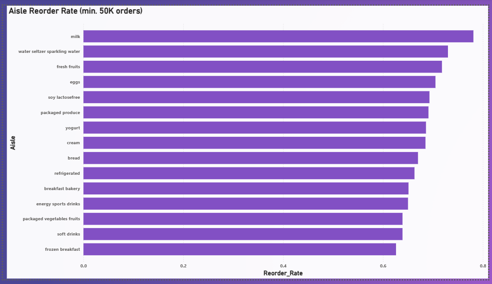
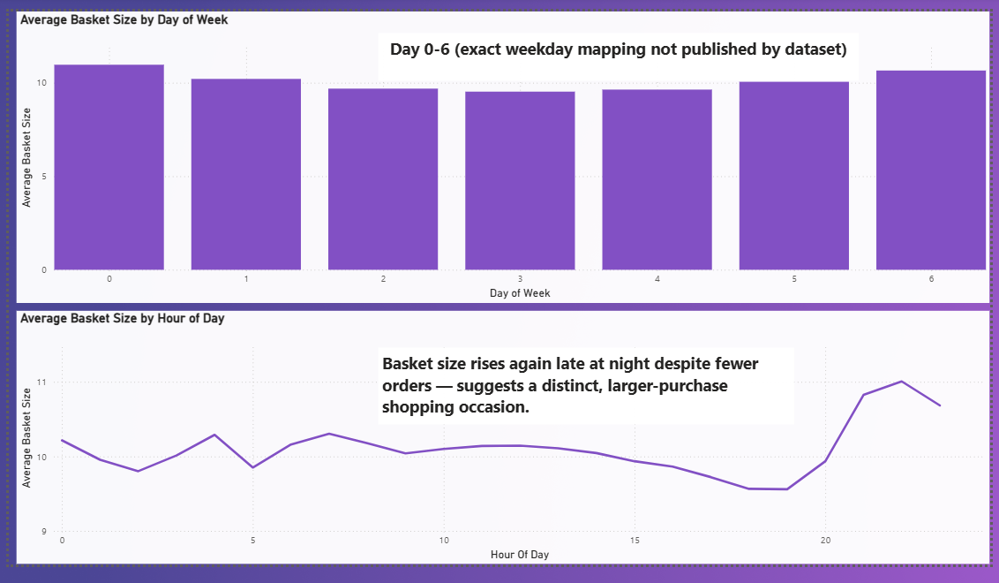
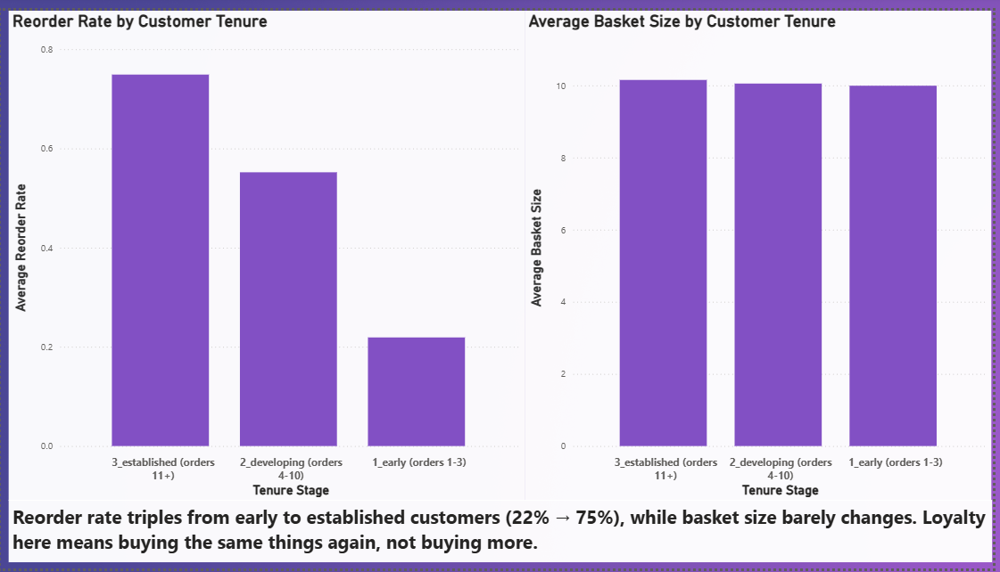
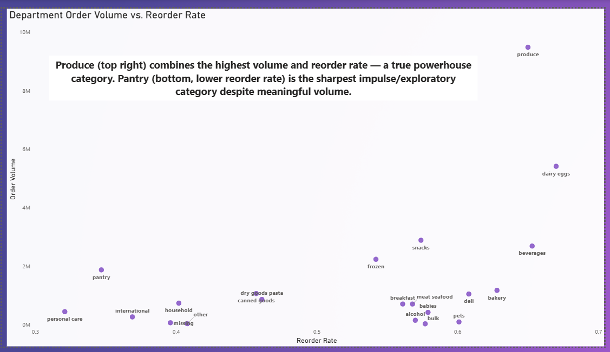
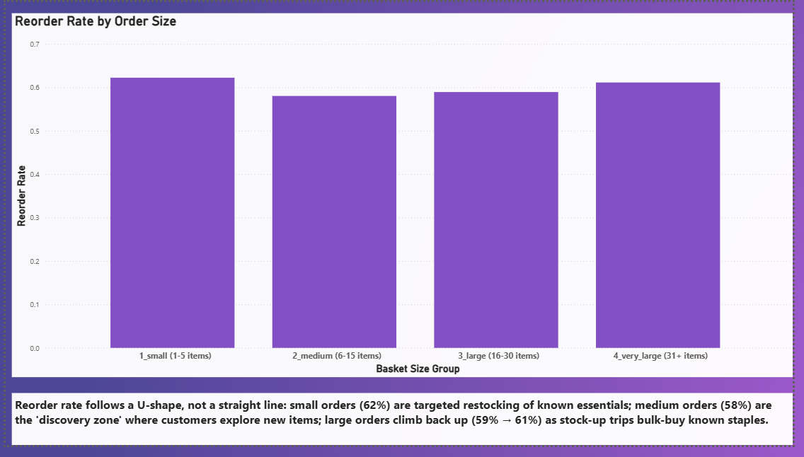

<div align="center">

# Instacart Basket Analytics

### Customer Loyalty · Basket Behavior · Product Discovery

**SQL · Python · Power BI**

</div>

---

## <font color="#7F4BC4">Project Overview</font>

This project analyzes the **Instacart Market Basket Analysis** dataset to understand how customers shop, what they reorder, how basket size changes across shopping occasions, and which product categories behave like **loyalty anchors versus exploratory purchases**.

Rather than focusing only on descriptive statistics, the analysis translates transactional data into **five business questions** covering customer loyalty, shopping timing, product behavior, department performance, and basket-size behavior.

The analysis was performed using **SQL and Python**, with **Power BI** used to build the final interactive dashboard.

---

## <font color="#7F4BC4">Business Questions</font>

| # | Business Question | Analysis |
|---|---|---|
| **Q1** | Which aisles have the highest reorder rates? | Aisle-level reorder behavior |
| **Q2** | Does basket size vary by shopping time? | Day and hour analysis |
| **Q3** | How does customer tenure affect loyalty? | Reorder rate & basket size by tenure |
| **Q4** | Which departments are staples vs. exploratory? | Order volume vs. reorder rate |
| **Q5** | Do different basket sizes represent different shopping missions? | Reorder rate by basket size |

---

## <font color="#7F4BC4">Dashboard Overview</font>

The five analytical views are combined into an interactive **Power BI dashboard** designed to provide a concise view of customer loyalty, basket behavior, and product performance.



---

## <font color="#7F4BC4">Key Findings</font>

### <font color="#7F4BC4">01 · Product Loyalty</font>

High-volume aisles such as **milk, water/seltzer, fresh fruits, eggs, and soy lactose-free** show particularly strong reorder behavior.

This suggests that frequently purchased grocery essentials are important **loyalty and retention categories**.



---

### <font color="#7F4BC4">02 · Basket Size & Timing</font>

Average basket size varies modestly throughout the day.

The analysis also shows that **late-night orders tend to have somewhat larger baskets**, suggesting a distinct shopping occasion despite lower overall order activity.



---

### <font color="#7F4BC4">03 · Customer Tenure Drives Reordering</font>

Reorder rate rises sharply as customers become more established:

**22% → 55% → 75%**

from early customers to developing customers and finally established customers.

However, average basket size remains almost unchanged:

**9.99 → 10.05 → 10.15 items**

This indicates that customer loyalty is primarily reflected in **buying the same products again**, rather than simply placing larger orders.



---

### <font color="#7F4BC4">04 · Staples vs. Exploratory Categories</font>

**Produce, dairy & eggs, and beverages** combine substantial order volume with above-average reorder rates, making them important **retention categories**.

By contrast, **pantry, frozen, and snacks** show meaningful order volume but weaker reorder behavior, making them stronger candidates for **discovery, cross-selling, and promotional strategies**.



---

### <font color="#7F4BC4">05 · Basket Size Shows a U-Shaped Pattern</font>

Reorder rate does not increase linearly with basket size:

| Basket | Reorder Rate |
|---|---:|
| Small (1–5 items) | **62.2%** |
| Medium (6–15 items) | **58.0%** |
| Large (16–30 items) | **58.9%** |
| Very Large (31+ items) | **61.1%** |

Small baskets appear more focused on **targeted restocking**, while very large baskets show characteristics of **stock-up trips**.

The medium and large basket range represents the **discovery zone**, where customers appear more open to products beyond their established purchasing pattern.



---

## <font color="#7F4BC4">Analytical Approach</font>

### 1. Data Preparation

The relational Instacart dataset was structured across orders, products, aisles, departments, and prior-order product transactions.

### 2. Exploratory Analysis

Python was used to explore:

- Order and basket distributions
- Reorder behavior
- Customer tenure
- Shopping time patterns
- Product and department activity

### 3. SQL Analysis

Five focused SQL analyses were developed to answer the core business questions.

The queries use joins, aggregations, conditional segmentation, basket-level calculations, and reorder-rate analysis.

### 4. Business Interpretation

The numerical results were translated into customer and merchandising insights rather than treated as standalone metrics.

### 5. Power BI Visualization

Power BI was used to create a six-page analytical dashboard with a consistent **purple-and-white visual theme**.

---

## <font color="#7F4BC4">Tools & Technologies</font>

**SQL**  
PostgreSQL · Joins · Aggregations · CASE statements · Analytical queries

**Python**  
Pandas · Exploratory Data Analysis · Data preparation

**Power BI**  
Data visualization · KPI cards · Bar charts · Scatter plots · Dashboard design

**GitHub**  
Project documentation · SQL repository · Analytical workflow

---

## <font color="#7F4BC4">Repository Structure</font>

```text
instacart_analysis/
│
├── data/
│   └── README.md
│
├── images/
│   ├── Overview.png
│   ├── q1.png
│   ├── q2.png
│   ├── q3.png
│   ├── q4.png
│   └── q5.png
│
├── notebooks/
│   └── 01_eda.ipynb
│
├── sql/
│   ├── q1_aisle_reorder_rate.sql
│   ├── q2_basket_size_by_time.sql
│   ├── q3_new_vs_tenured_customers.sql
│   ├── q4_department_frequency_vs_reorder.sql
│   └── q5_order_size_vs_reorder.sql
│
└── visualization/
    └── instacart_viz.pbix
